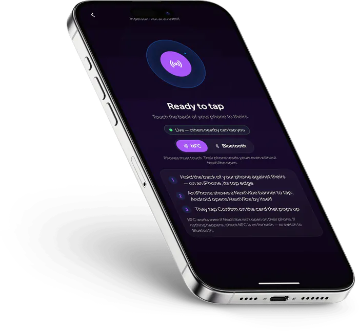
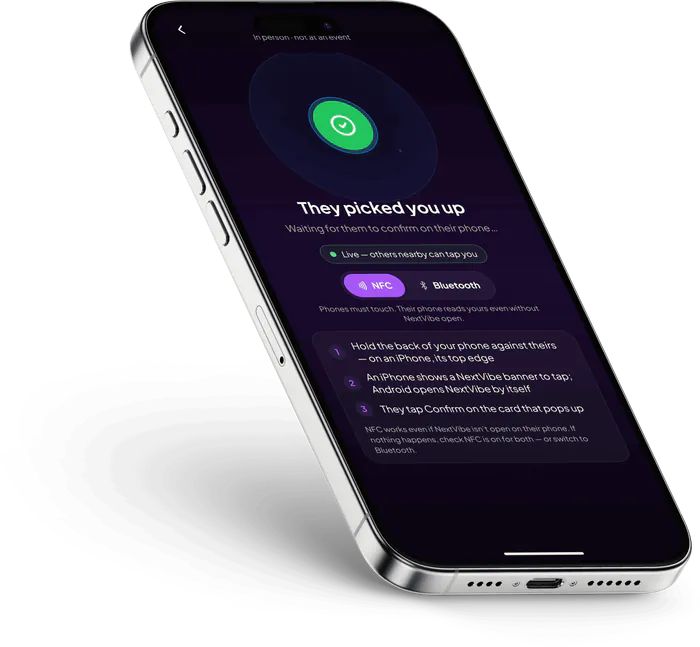
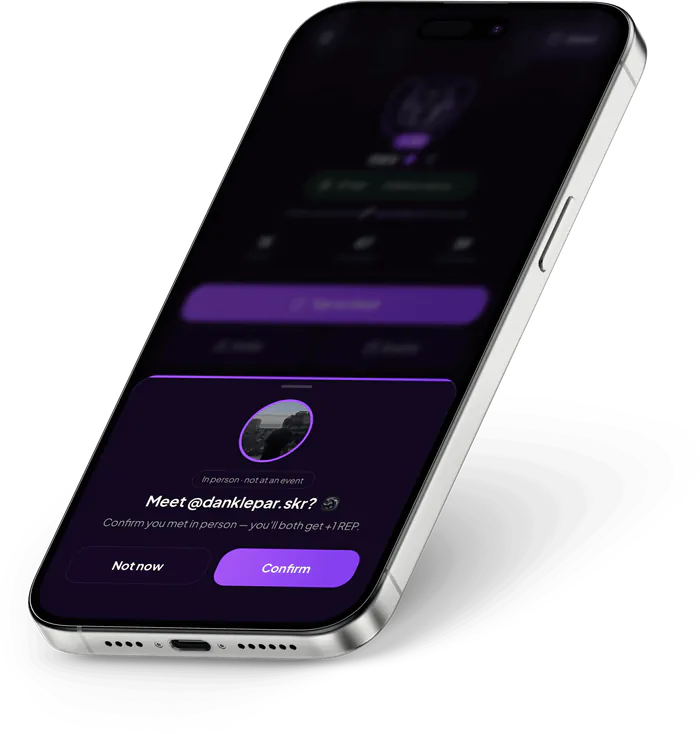
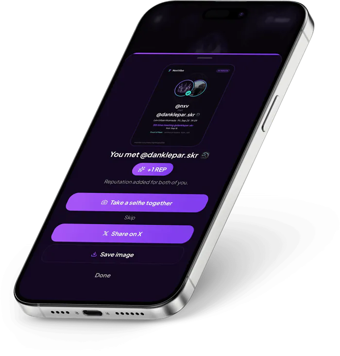
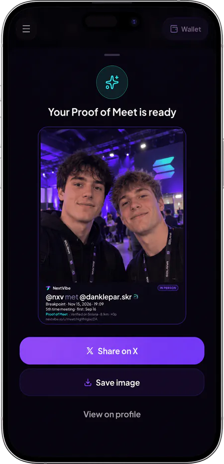
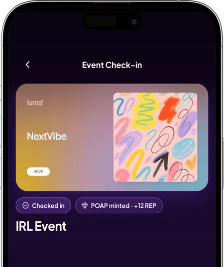
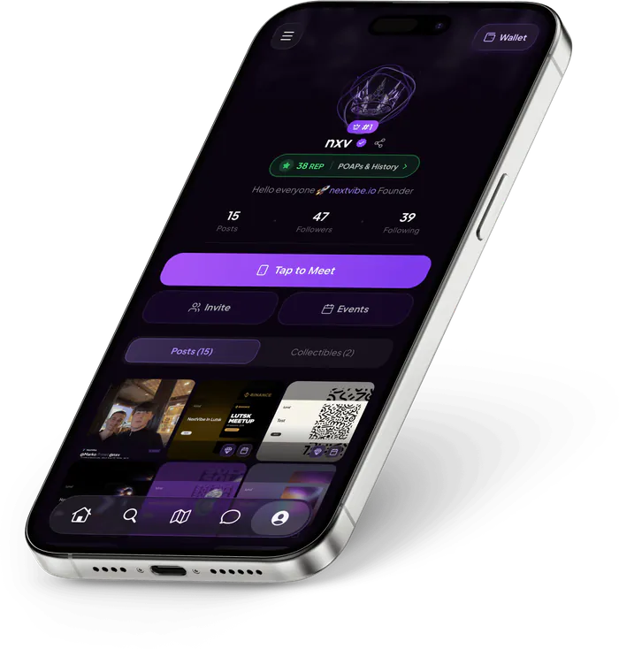
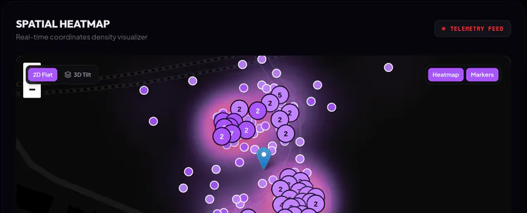
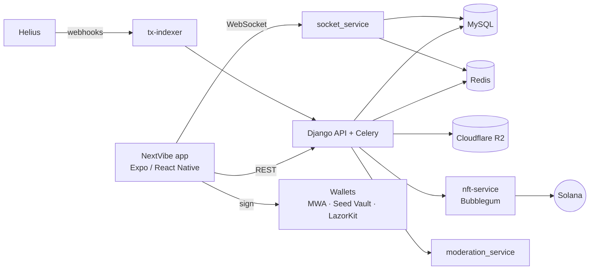

<p align="center">
  
</p>

<h1 align="center">NextVibe</h1>

<p align="center"><strong>Tap phones. Prove you met.</strong> The IRL networking layer on Solana.</p>

NextVibe turns meeting someone in person into proof on Solana. Two people hold their phones
together and both get a Proof of Meet: a card to share on X and a compressed NFT that names
both of their wallets. Event organizers import a Luma event, check people in with the same
tap, give every attendee a POAP, and see on a live dashboard who came and who met whom.

## Links

| | |
|---|---|
| Website | https://nextvibe.io |
| Solana dApp Store | `solanadappstore://details?id=com.nextvibe.app` (open on a Seeker) |
| Android APK | https://media.nextvibe.io/NextVibe.apk |
| iOS | TODO(founder): App Store link after approval |
| Demo video | TODO(founder): link to the CLOCK IN demo video |
| Organizer dashboard | https://dashboard.nextvibe.io |

<p align="center">
  
  
  
  
</p>
<p align="center">
  
  
  
  
</p>

## What it does

- **Tap to Meet.** Phones find each other over NFC (Android emulates an NFC tag that iPhones
  read in the background), Bluetooth LE on both platforms, or a QR code on iPhone. The other
  person confirms, and both get REP (+1 each outside events). [How it works](docs/TAP_TO_MEET.md)
- **Proof of Meet.** Every meet gets a public card (`nextvibe.io/u/meet/…`) and one cNFT per
  person with both wallets as creators. The two can add one selfie, published only when both
  say yes.
- **Events.** Import a Luma event, prove it's yours with an NV code, approve requests, and
  check people in with a tap (geofenced when the event has a location). Attendees get REP and
  a POAP; taps at the event count toward the event's stats. [Events](docs/EVENTS.md)
- **No wallet needed to start.** POAPs and Proof of Meet are saved to the profile first
  ("POAP saved · claim anytime") and go on Solana when the person connects a wallet and claims.
- **Free collects.** Posts can be collected as cNFTs, 50 editions each; NextVibe pays the
  network fee, and on Android the collector co-signs with their wallet.
- **Seeker Verified.** A badge for wallets that hold a Seeker Genesis Token, checked on-chain
  through Helius, with a share card.
- **Wallets.** Mobile Wallet Adapter with Seed Vault on Seeker, LazorKit passkey wallets, and
  Phantom, Solflare or Backpack on iOS. Jupiter swaps on Android; tap-to-pay requests over
  NFC or Bluetooth.
- **Organizer dashboard.** Requests, check-ins, POAP claims, a heat map of taps, who met whom,
  top attendees and push broadcasts, at https://dashboard.nextvibe.io.
- **Also:** realtime chats ([encryption status](docs/SECURITY.md#chats-and-encryption)),
  AI moderation of every public post and selfie, and a map of posts and events on H3 cells.

## Architecture



Details: [docs/ARCHITECTURE.md](docs/ARCHITECTURE.md) · API: [docs/API.md](docs/API.md)

## Repository map

| Folder | What it is | Language | Docs |
|---|---|---|---|
| `frontend/NextVibe` | The mobile app (Android and iOS) | TypeScript, Expo SDK 55, React Native 0.83 | [README](frontend/NextVibe/README.md) |
| `backend/NextVibeAPI` | REST API, Celery workers, push and email console | Python, Django 4.2, DRF, Celery | [README](backend/NextVibeAPI/README.md) |
| `nft-service` | Compressed NFT minting and the Seeker Genesis Token check | TypeScript, Bun, Elysia, Metaplex Umi | [README](nft-service/README.md) |
| `tx-indexer` | Wallet transaction history from Helius | TypeScript, Bun, Elysia, BullMQ | [README](tx-indexer/README.md) |
| `socket_service` | Realtime chats and in-app events | Python, FastAPI | [README](socket_service/README.md) |
| `moderation_service` | Text and image moderation | Go | [README](moderation_service/README.md) |
| `docs` | Architecture, API, Solana, Tap to Meet, events, security | Markdown | [docs](docs) |

The website (nextvibe.io, with the `/u/…` share pages) and the organizer dashboard are
separate repositories.

## How to run it

### A. Just try it

- **Solana Seeker / Android:** install NextVibe from the Solana dApp Store
  (`solanadappstore://details?id=com.nextvibe.app`) or download the APK:
  https://media.nextvibe.io/NextVibe.apk.
- **iOS:** TODO(founder): App Store link after approval.

Tap to Meet needs two phones. An invite code is optional when you sign up.

### B. Run the app from source against the production API (recommended)

The app already talks to `https://api.nextvibe.io/api/v1` (`frontend/NextVibe/src/utils/url_api.ts`),
so there is no backend to set up. It needs a development build: NextVibe has its own native
modules (NFC host card emulation, Bluetooth), Mapbox and the Mobile Wallet Adapter, so Expo Go
won't run it.

Requirements: Node.js, JDK 17, the Android SDK (Android Studio) and an Android phone with USB
debugging (emulators can't do NFC, and their Bluetooth support is limited).

```bash
cd frontend/NextVibe
cp .env.example .env        # set RNMAPBOX_MAPS_DOWNLOAD_TOKEN before the first prebuild
npm install
npx expo prebuild --platform android
npx expo run:android
```

| Variable (`frontend/NextVibe/.env`) | Needed? | Without it |
|---|---|---|
| `RNMAPBOX_MAPS_DOWNLOAD_TOKEN` | yes | The Android build can't download the Mapbox SDK. Use a Mapbox secret token with `DOWNLOADS:READ`. |
| `EXPO_PUBLIC_MAPBOX_TOKEN` | recommended | Maps stay empty and place names don't load. |
| `EXPO_PUBLIC_JUPITER_API_KEY` | no | Swaps use Jupiter's keyless lite API. |
| `EXPO_PUBLIC_PAYMASTER_URL`, `EXPO_PUBLIC_PAYMASTER_API_KEY` | no | Sponsored (gasless) wallet transactions don't work; everything else does. |
| `EXPO_PUBLIC_VEXO_API_KEY` | no | No analytics. |

If you ran prebuild before setting the Mapbox token, run
`rm -rf node_modules/@rnmapbox/maps && npm install && npx expo prebuild --platform android --clean`.
More in [frontend/NextVibe/README.md](frontend/NextVibe/README.md).

Checked on Sep 27, 2026 from a clean export of this repository (Node 26.7, npm 11.19):
`npm ci`, `npx expo prebuild --platform android` and a full Android JavaScript bundle
(`npx expo export --platform android`, 5,089 modules) succeed. The last step,
`npx expo run:android`, wasn't run there because that machine has no Android SDK.

### C. Self-host the backend (advanced, not needed to evaluate)

The backend reads more than 40 environment variables and needs accounts with Helius,
Cloudflare R2, Resend, Mapbox, Expo push, OpenAI, Replicate and Cherry, a MySQL database, Redis,
and a funded Solana keypair that pays fees and owns the Merkle tree and the collections (see
`nft-service/src/create-tree.ts`). Running it locally is a lot of work; to evaluate NextVibe,
use the production API (path B).

If you still want to: every service has a `.env.example` and a README with its run steps:
[API](backend/NextVibeAPI/README.md) · [nft-service](nft-service/README.md) ·
[tx-indexer](tx-indexer/README.md) · [socket_service](socket_service/README.md) ·
[moderation_service](moderation_service/README.md). Django migrations aren't committed; the
API README explains how to create them for a new database.

## Solana

- **cNFTs everywhere.** POAPs, Proof of Meet, collected posts and the OG badge are Metaplex
  Bubblegum compressed NFTs in one Merkle tree (depth 14, 16,384 leaves), minted with
  `mintToCollectionV1` by `nft-service`.
- **NextVibe pays.** One backend keypair is the fee payer, tree owner and collection
  authority; people never need SOL for any of it. Mints go through a queue with daily caps
  and retries (`backend/NextVibeAPI/posts/src/collectible_mint.py`).
- **Co-signed collects.** On Android, a collect is one transaction with a mint and an SPL Memo
  (`NextVibe | collected post <id> | #<n> of <total>`) that requires the collector's
  signature from their wallet (Mobile Wallet Adapter, Seed Vault on Seeker).
- **Both wallets on-chain.** Each Proof of Meet leaf lists both people's wallets as creators.
- **Seeker Genesis Token check** over Helius RPC (Token-2022 mint authority and group).
- **Helius** for RPC, DAS lookups and the webhooks behind wallet history (`tx-indexer`).

Step by step, with the code for each flow: [docs/SOLANA.md](docs/SOLANA.md).

## Built during CLOCK IN

The work done since Sep 8, 2026, with dates and files, is in
[CHANGELOG-hackathon.md](CHANGELOG-hackathon.md).

## Team

- **Danylo Klepar**, founder and developer: [@DanKlepar](https://x.com/DanKlepar),
  Telegram [@danylo_nv](https://t.me/danylo_nv), dklepar29@gmail.com
- **Mark Vendysh**, co-founder, business development and operations

Project on X: [@NextVibeWeb3](https://x.com/NextVibeWeb3). Security reports:
[docs/SECURITY.md](docs/SECURITY.md).

## License

TODO(founder): choose a license. Until one is added, all rights are reserved, as the previous
README stated.
