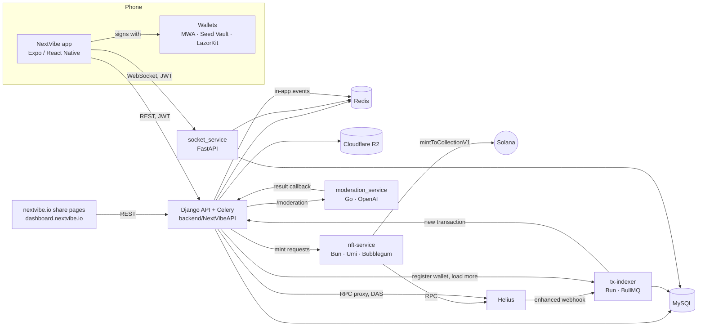

# Architecture

NextVibe is one mobile app backed by a Django API and four small services, all in this
repository, plus two web apps in their own repositories (the website with share pages, and
the organizer dashboard). Production runs on one host.

## Services

| Service | Folder | Runtime | Entry | Listens on | Production unit |
|---|---|---|---|---|---|
| API | `backend/NextVibeAPI` | Python 3, Django 4.2, DRF, Celery 5.5 | `manage.py`, `NextVibeAPI/wsgi.py`, `NextVibeAPI/celery.py` | 8000 in development | `nextvibe-backend`, `nextvibe-celery-worker`, `nextvibe-celery-beat` |
| Realtime | `socket_service` | Python 3, FastAPI | `main.py` (`/ws`, `/api/v2/*`) | set by the unit (`realtime.nextvibe.io` in production) | `nextvibe-realtime` |
| cNFT minting | `nft-service` | Bun, Elysia, Metaplex Umi | `src/index.ts` | 3000 | `nextvibe-nft` |
| Wallet history | `tx-indexer` | Bun, Elysia, BullMQ | `src/index.ts` | `PORT` (default 3000) | `nextvibe-indexer` |
| Moderation | `moderation_service` | Go 1.22 | `main.go` | `PORT` (default 8080) | `nextvibe-moderation` |
| App | `frontend/NextVibe` | Expo SDK 55, React Native 0.83 | `app/_layout.tsx` (expo-router) | — | EAS builds and OTA updates |

The website (nextvibe.io, including the `/u/…` share pages) and the organizer dashboard
(dashboard.nextvibe.io) are separate repositories; both call the same API.

## Requests

- The app calls `https://api.nextvibe.io/api/v1` (hardcoded in
  `frontend/NextVibe/src/utils/url_api.ts`) with `Authorization: Bearer <access token>`, and
  refreshes tokens through `/users/token/refresh/`. See [API.md](API.md).
- Solana reads from the app go through the API's JSON-RPC proxy (`/api/v1/wallets/rpc/`,
  forwarded to Helius mainnet), so the app holds no RPC key.

## Realtime

- The app opens `wss://realtime.nextvibe.io/ws?token=<access token>`; the socket service
  checks the same JWT (it needs the API's `SECRET_KEY` as `JWT_SECRET_KEY`).
- Chats, receipts, reactions, typing and presence go over the socket; chat history and media
  uploads use its REST routes under `https://realtime.nextvibe.io/api/v2`. Offline recipients
  get an Expo push.
- The socket service reads and writes the chat tables in the API's MySQL database directly
  (SQLAlchemy) and publishes events to other instances over the Redis channel
  `chat_pubsub_events`.
- The API uses the same channel to reach the app without a socket of its own: it publishes
  `meet_photo` and `collectible` events there (`posts/src/realtime.py`), and the socket
  service delivers them to the user's connections.

## Minting

1. An action records what someone should get: a collect, a publish, or a `Collectible` row
   (POAP at check-in, Proof of Meet at a tap).
2. Collects and publishes call nft-service directly. POAPs and Proof of Meet go through a
   Celery queue (`posts/src/collectible_mint.py`) that calls nft-service one mint at a time,
   retries with back-off and respects a daily cap.
3. nft-service signs with the backend keypair, pays the fee and mints into the shared
   Bubblegum tree. Metadata JSON is served by the API.

Details: [SOLANA.md](SOLANA.md).

## Moderation

- A new post is sent to moderation when the app finalizes it: Celery posts the text and media
  URLs to `http://127.0.0.1:8080/moderation`; the Go service checks them with OpenAI
  `omni-moderation-latest` and calls back `/api/v1/posts/moderation-callback/`, which
  approves or rejects the post and notifies the author.
- Proof of Meet selfies and captions are checked synchronously before anyone sees them.
- A Celery task removes posts still pending after 10 minutes.

## Wallet history

- When someone links a wallet, the API registers it with the tx-indexer, which fetches recent
  transactions from the Helius Enhanced Transactions API and adds the address to a Helius
  webhook.
- Helius posts new transactions to the indexer's webhook; the indexer stores them in the
  `transactions` table of the same MySQL database and tells the API
  (`/api/v1/wallets/webhook-notify/`), which notifies the owner.
- The app reads history from the API, which reads the indexer's table.

## Storage

| Store | Used by | What |
|---|---|---|
| MySQL (utf8mb4) | API, socket service, tx-indexer | One database. The API owns the schema (Django models); the socket service uses the chat and user tables; the tx-indexer owns `transactions` and `sync_cursors` (`tx-indexer/migrations/001_create_tables.sql`). |
| Redis db 0 | API | Celery broker and results |
| Redis db 1 | API | Cache: rate limits, Seeker check results, DAS answers, geocoding, the mint slot, tree status |
| Redis (pub/sub) | API, socket service | `chat_pubsub_events`; presence, typing and per-user rate limits of the socket service |
| Redis | tx-indexer | BullMQ queue `tx-fetch`, the busy-wallet counter |
| Cloudflare R2, public bucket | API, socket service | Avatars, post media and previews, chat media, share cards (`media.nextvibe.io`) |
| Cloudflare R2, private bucket | API | Proof of Meet selfie uploads, read through 10-minute signed URLs |

Django migrations are not committed (`backend/.gitignore`); production generates them on the
host (`makemigrations` + `migrate`).

## Scheduled jobs (Celery beat)

| Job | Task | When |
|---|---|---|
| Stale moderation | `posts.tasks.auto_moderation_check` | every 5 min |
| Collectibles queue sweep | `posts.tasks.sweep_collectibles` | every 2 min |
| Proof of Meet selfie sweep | `posts.tasks.sweep_meet_photos` | every 10 min |
| Wallet reminders | `posts.tasks.send_wallet_reminders` | hourly at :05 |

## External services

| Service | Used for | Where |
|---|---|---|
| Helius | RPC, DAS, enhanced transactions, webhooks | nft-service, API, tx-indexer |
| Cloudflare R2 | Media storage | API, socket service |
| OpenAI | Moderation of posts and selfies | moderation_service |
| Resend | Email (the host can't use SMTP) | API (`nvcli/`) |
| Expo | Push notifications | API, socket service |
| Mapbox (or OpenStreetMap Nominatim) | Maps in the app, city names for meets | app, API |
| Luma | Public event pages read during import | API |
| Replicate | AI image generation in posts | API |
| CoinGecko | Token prices | API |
| Jupiter | Swaps (Android) | app |
| LazorKit | Passkey wallets and sponsored transactions | app |
| Cherry | Group chat embedded in the app | API, app |

## Deployment

Pushing `main` runs `.github/workflows/deploy.yml`: over SSH the host resets to `origin/main`,
installs Python requirements (`backend/modules.txt`), runs `migrate` and `collectstatic`,
builds the Go service, runs `bun install` for nft-service and tx-indexer, restarts the
systemd units above and reloads nginx. The app ships through EAS builds and OTA updates; the
two web apps are deployed separately.
